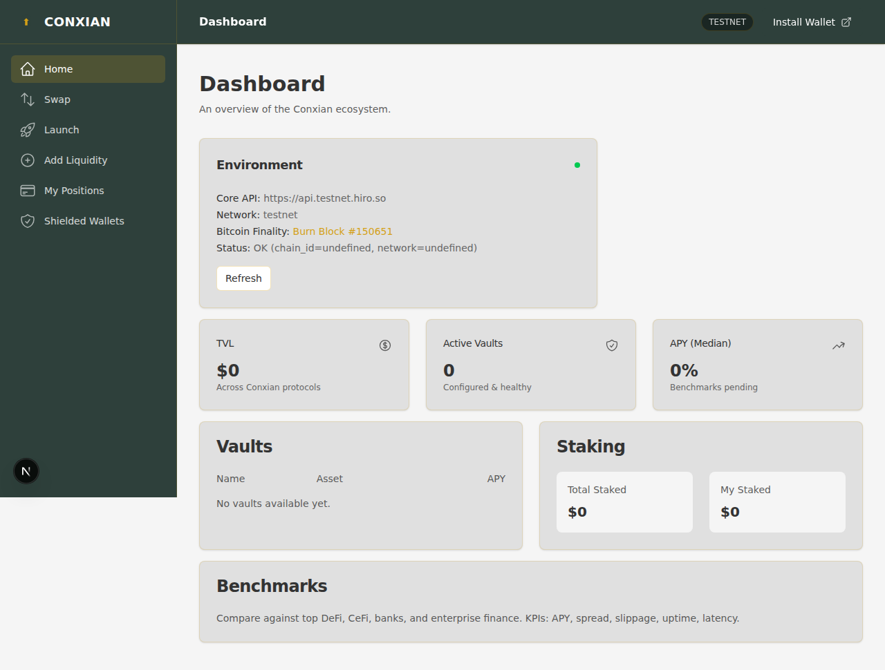
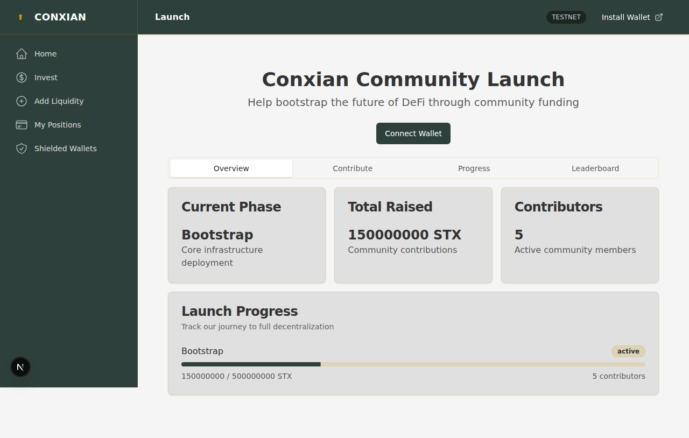
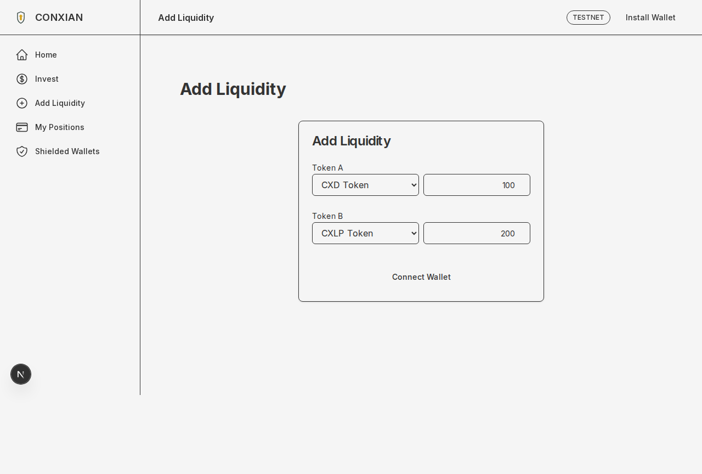
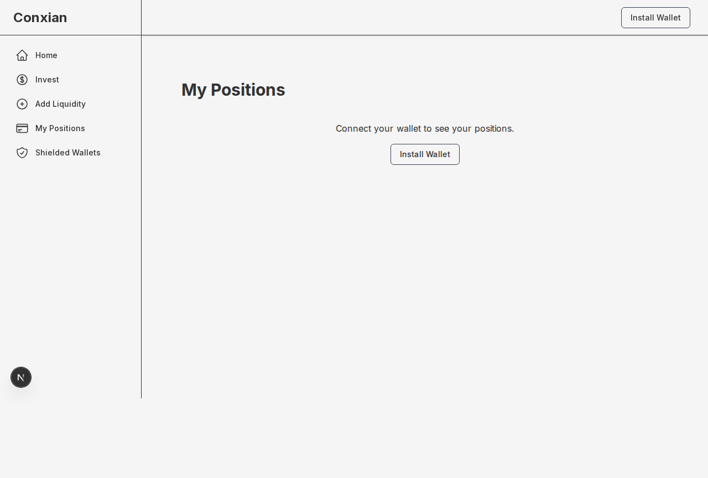
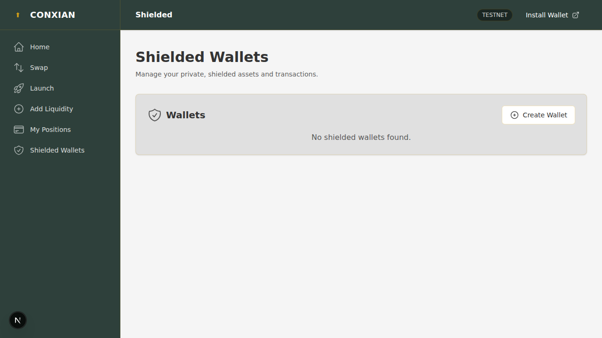
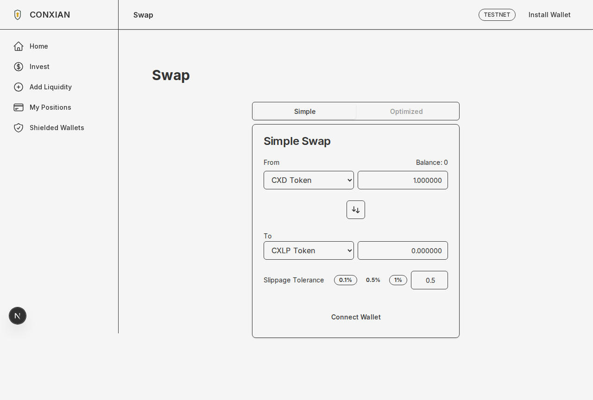

# Conxian UI User Guide

This guide provides a comprehensive overview of the Conxian UI, from getting started to mastering its most advanced features.

## Getting Started

Getting up and running with the Conxian UI is easy. Just follow these simple steps:

### 1. Connect Your Wallet

Start by connecting your Stacks wallet. Click the "Connect Wallet" button in the top-right corner and approve the connection in your wallet extension. You'll receive a **toast notification** confirming your connection status.


### Step 2: Explore Conxian's Features

Once your wallet is connected, you can navigate through the sidebar to access different features of the Conxian ecosystem.

#### Dashboard (Home)
The default landing page provides an overview of the Conxian ecosystem.



#### Launch (Community Self-Launch)
Participate in the community-driven launch of the Conxian protocol.
*   **Overview**: Track the current launch phase, total funds raised, and active contributors.
*   **Contribute**: Support the project by contributing STX.
*   **Progress**: View detailed progress of each launch phase.
*   **Leaderboard**: See top contributors and your own standing.



#### Add Liquidity
Access the "Add Liquidity" page to contribute tokens to liquidity pools, enabling seamless swaps and earning rewards.



#### My Positions
Visit "My Positions" to view and manage your current liquidity positions. Here, you can see your share in various pools and remove liquidity when desired.



#### Shielded Wallets
Explore "Shielded Wallets" for enhanced privacy. Create new shielded wallets, manage existing ones, and perform private transactions (send/receive funds).



#### Swap
Click on the "Swap" link to access our user-friendly interface for exchanging one token for another.



#### Transaction Feedback

Throughout your interaction with the Conxian UI, you will receive real-time feedback through **toast notifications**. These pop-up messages will inform you about the success or failure of your transactions, wallet connections, and other important actions.

## For Our PRO Users: Unleash the Power of Conxian

Our PRO mode is designed for power users who want to take full advantage of the Conxian ecosystem. With a sleek, dark-themed interface and advanced features, you'll feel right at home.

### The PRO Experience:

*   **A Professional Look and Feel**: Our PRO mode features a dark-themed navbar and a "PRO" label next to the logo, so you know you're in the right place.
*   **Advanced Features**: Access to advanced features and a more detailed view of the Conxian ecosystem.
*   **A Seamless Transition**: Switch between retail and PRO modes with ease, so you can choose the experience that's right for you.

## For Our Developers: A Quick Start Guide

Ready to dive in and start building? Here's how to get up and running in no time:

### Step 1: Clone the Repo

```bash
git clone https://github.com/Conxian/Conxian-UI.git
```
### Step 2: Install Dependencies
```bash
npm install
```
### Step 3: Run the Dev Server

```bash
NEXT_PUBLIC_CORE_API_URL=https://api.testnet.hiro.so npm run dev
```
And that's it! You're ready to start building.

## We're Here to Help

Whether you're a retail user, a pro, or a developer, we're here to help you make the most of the Conxian UI. If you have any questions, don't hesitate to reach out to our team. Happy building!
